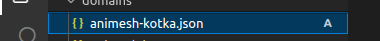

import Tag from '@site/src/components/Tag';

# Claim Your Free Developer Domain with is-a.dev  

In today’s tech-driven world, having a personal domain sets you apart as a developer. Whether you're showcasing a portfolio, hosting projects, or sharing your blog, **is-a.dev** offers a free, professional subdomain tailored specifically for developers.  

This guide will walk you through the steps to claim your **is-a.dev** subdomain effortlessly.  

---

## Why Choose is-a.dev?  

**is-a.dev** provides free subdomains to developers who want to establish an online presence. It's part of the `.dev` domain family, known for its Google-backed security and HTTPS enforcement by default.  

### Key benefits:  
- **Professionalism**: Perfect for portfolios and technical projects.  
- **Free for Life**: No hidden costs.  
- **Easy Integration**: Works seamlessly with platforms like GitHub Pages, Netlify, or Vercel.  

---

## How to Get Your is-a.dev Domain  

Follow these three simple steps to set up your is-a.dev domain:

{/* truncate */}

### 1. Setting up the Repository

First, visit the [is-a-dev/register repository](https://github.com/is-a-dev/register) on GitHub. If you don't already have a GitHub account, [sign up here](https://github.com/signup).  

Here’s what to do next:
1. **Fork and Clone the Register Repository:**
  - On top corner, you will see fork option button.
  - By clicking it, we will create a fork for the register repo.
  
  - Once forked, you can clone the repo by https/ssh.
  :::note
  If want to know more about how to handle multiple ssh key for git, checkout out my blog [here](./2024-11-30-Managing-Multiple-GitHub-Accounts.mdx)
  :::


### 2. Creating the JSON File  

1. **Navigate to the domains folder**:  
   - In the repository, go to the `domains/` folder.  
   - Click the **Add file** button and select **Create new file**.  

2. **Name the JSON File**:  
   - Name the file after the subdomain you want.  
   - Example: If you want `john-doe.is-a.dev`, name your file `john-doe.json`.  

   **Naming Requirements**:  
   - Must be **2–63 characters long**.  
   - Only dashes (`-`) are allowed; no underscores (`_`).  
   - Use standard English characters.  
   

  After naming your file you need to put the JSON content into it, here is an example JSON structure:


3. **Add the JSON Content**:  
   Use this template for your JSON file:  

   ```json
   {
    "description": "Describe the use of this subdomain",
    "repo": "https://github.com/github-username/github-repository",
    "owner": {
        "username": "github-username",
        "email": "[email protected]"
        },
    "record": {
        "CNAME": "github-username.github.io"
        }
    }
   ```
    - Replace your-github-username with your GitHub username.
    - For RECORDTYPE set it to what you require for your use. You can see the records, in this case I am using my GitHub Page.
    In your case, you use s3 static hosting url as well.
  
### 3. Create your pull request:

Now you should be greeted with a screen which looks like this:


All you need to do here is fill out the requirements and place an `x` between the `[ ]` (so it looks like `[x]`) for each requirement you meet.
Please make sure you meet all the requirements before creating the pull request.

Once you have filled out the requirements you can then click the Create pull request button and you're done!

### 4. Wait for Approval
Your pull request will now be reviewed by the maintainers.

- Typical wait time: 12-24 hours (sometimes longer).
- Keep an eye on your PR in case maintainers request changes.

Once merged, your is-a.dev subdomain will be live and ready to use!

### Issues with GitHub Pages
- After the pull request is merged, you may see a **404** error on **subdomain.is-a.dev** or the wrong site.
To fix this, go to your GitHub pages repository's **Settings > GitHub pages > Custom Domain** and add **subdomain.is-a.dev** in the given field.
Only do this <Tag color="#FF5733">after your pull request is merged.</Tag>
- Check the **Enforce HTTPS** checkbox below the custom domain input.
- Wait some time and your site should be live!
