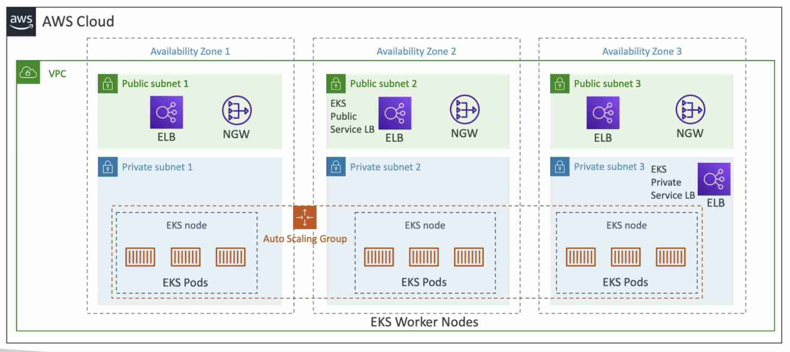

import TOCInline from '@theme/TOCInline';
import Tag from '@site/src/components/Tag';

- Used to launch Kubernetes (open-source) clusters on AWS
- Supports both EC2 and Fargate launch types
- Inside the EKS cluster, we have EKS nodes (EC2 instances) and EKS pods (tasks) within them. We can use a private or public load balancer to access these EKS pods.

:::note
CloudWatch Container Insights can be configured to view metrics and logs for an EKS cluster in the CloudWatch console
:::

## Use case
If your company is already using Kubernetes on-premises or in another cloud, and wants to migrate to AWS using Kubernetes
