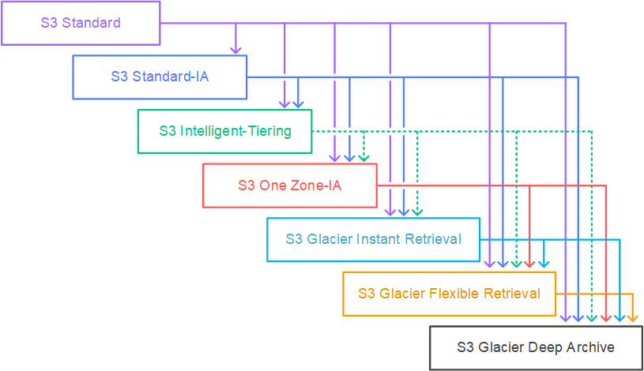

import TOCInline from '@theme/TOCInline';
import Tag from '@site/src/components/Tag';

{/* <TOCInline toc={toc} minHeadingLevel={2} maxHeadingLevel={6} /> */}

## AMI and Snapshot Behavior

- When the new <Tag color="#87cefa">AMI</Tag> is copied from <Tag color="#f08080">Region A</Tag> into <Tag color="#f08080">Region B</Tag>, it automatically creates a <Tag color="#f08080">snapshot</Tag> in Region B because AMIs are based on the underlying snapshots. 

---

## Messaging & Streaming

- By default, <Tag color="#ffb347">FIFO queues</Tag> support up to <Tag color="#f08080">300 messages/second</Tag> (send, receive, or delete ops).
- <Tag color="#ffb347">Amazon Kinesis Data Firehose</Tag> is a fully managed service for real-time streaming delivery to:
  - <Tag color="#87cefa">Amazon S3</Tag>, <Tag color="#87cefa">Redshift</Tag>, <Tag color="#87cefa">OpenSearch</Tag>, <Tag color="#87cefa">Splunk</Tag>, or custom endpoints.
  - Supported providers: <Tag color="#f4a460">Datadog</Tag>, <Tag color="#f4a460">Dynatrace</Tag>, <Tag color="#f4a460">LogicMonitor</Tag>, <Tag color="#f4a460">MongoDB</Tag>, <Tag color="#f4a460">New Relic</Tag>, <Tag color="#f4a460">Sumo Logic</Tag>.
  - <Tag color="BLUE">But Firehose cannot directly write into a DynamoDB table</Tag>.

---

## Storage Services

- <Tag color="#ffb347">Amazon FSx for Lustre</Tag> is a high-performance file system used in:
  - <Tag color="#90ee90">Machine learning</Tag>, <Tag color="#90ee90">HPC</Tag>, <Tag color="#90ee90">video processing</Tag>, <Tag color="#90ee90">financial modeling</Tag>.
- <Tag color="#ffb347">AWS Storage Gateway</Tag> offers:
  - <Tag color="#87cefa">File Gateway</Tag>: SMB/NFS access with caching.
  - <Tag color="#87cefa">Volume Gateway</Tag>: iSCSI block storage for on-prem apps.
  - <Tag color="#87cefa">Tape Gateway</Tag>: move tape backups to the cloud.
- <Tag color="#ffb347">Instance store</Tag> is ideal for temporary storage (buffers, caches, scratch data).
- <Tag color="#ffb347">S3</Tag>: No data transfer charges for internet uploads.

---

## Databases

- <Tag color="#ffb347">Amazon RDS Custom</Tag> for Oracle:
  - Enables custom patches, host-level config, and privileged access for third-party integrations.
- <Tag color="#ffb347">Amazon Aurora</Tag> read replicas:
  - Prioritized with tiers (0–15).
  - During failover, lowest tier gets promoted; if tied, largest replica is promoted.
- <Tag color="BLUE">Babelfish</Tag> allows <Tag color="#ffb347">Aurora PostgreSQL</Tag> to understand <Tag color="#f4a460">T-SQL</Tag> and <Tag color="#f4a460">SQL Server wire protocol</Tag> for easier migration.

---

## Networking & Acceleration

- <Tag color="#ffb347">Georestriction</Tag> (geo-blocking): Prevent access by location in <Tag color="#87cefa">CloudFront</Tag>.
- <Tag color="#ffb347">AWS Global Accelerator</Tag>:
  - Provides static IPs for multi-region app entry points (ALB, NLB, EC2).
  - Not effective for accelerating file uploads to S3.
  - Ideal for non-HTTP use cases like:
    - <Tag color="#f4a460">Gaming (UDP)</Tag>, <Tag color="#f4a460">IoT (MQTT)</Tag>, <Tag color="#f4a460">VoIP</Tag>, and HTTP use cases requiring <Tag color="#f08080">static IPs</Tag> or fast failover.
- A <Tag color="#ffb347">gateway endpoint</Tag> is added to route tables for AWS services like:
  - <Tag color="#87cefa">Amazon S3</Tag>
  - <Tag color="#87cefa">DynamoDB</Tag>

---

## Monitoring & Metrics

- In <Tag color="#ffb347">CloudWatch</Tag>, the following metrics <Tag color="#f08080">are not readily available</Tag>:
  - Memory utilization  
  - Disk swap  
  - Disk space  
  - Page file  
  - Log collection

---

## Security & Data Movement

- <Tag color="#ffb347">Amazon GuardDuty</Tag> analyzes billions of events across:
  - <Tag color="#87cefa">CloudTrail</Tag>, <Tag color="#87cefa">VPC Flow Logs</Tag>, and <Tag color="#87cefa">DNS logs</Tag>.
- Each <Tag color="#ffb347">Snowball Edge Storage Optimized</Tag> device handles up to <Tag color="#90ee90">80 TB</Tag> of data.

---

## Compute Limits

- <Tag color="#ffb347">AWS Lambda</Tag> supports <Tag color="#f08080">1000 concurrent executions</Tag> per AWS account per region.
  - Be aware of this if <Tag color="#87cefa">SNS</Tag> triggers lead to excessive Lambda usage.

---

## Content Behavior in CloudFront

- <Tag color="#ffb347">CloudFront</Tag>:
  - Dynamic content (when all headers forwarded) bypasses regional edge caches and goes directly to the <Tag color="#87cefa">origin</Tag>.

---

