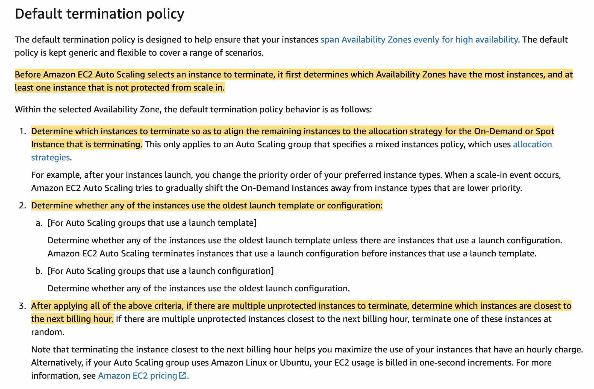
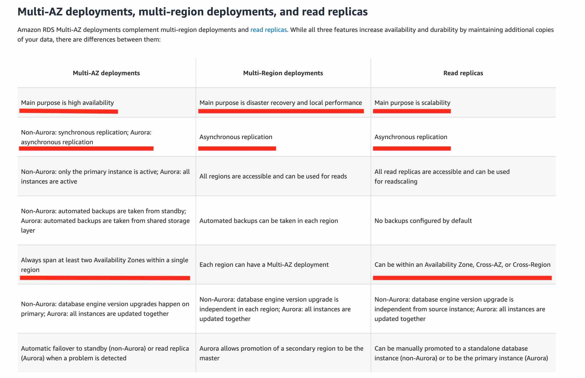
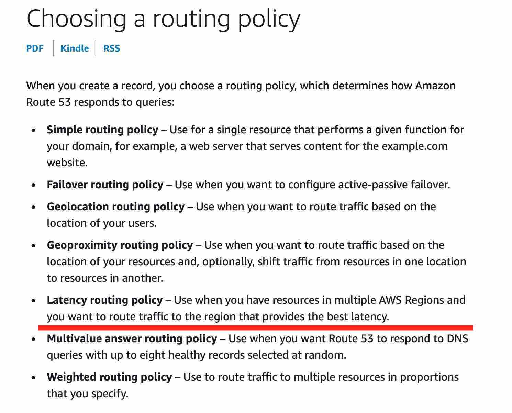

import TOCInline from '@theme/TOCInline';
import Tag from '@site/src/components/Tag';

- **AWS Secrets Manager** helps you protect secrets needed to access your applications, services, and IT resources.
	The service enables you to easily rotate, manage, and retrieve database credentials, API keys, and other secrets throughout their lifecycle.
	Users and applications retrieve secrets with a call to Secrets Manager APIs, eliminating the need to hardcode sensitive information in plain text.
	Secrets Manager offers secret rotation with built-in integration for Amazon RDS, Amazon Redshift, and Amazon DocumentDB.
	**KMS is an encryption service, it's not a secrets store**.
- **Auto Scaling group (ASG) is not terminating an unhealthy Amazon EC2 instance:**
	- The instance maybe in Impaired status
	- The health check **grace period** for the instance has not expired
	- Instance has failed the Elastic Load Balancing (ELB) health check status
	
- 
- **Amazon RDS Read Replicas** are meant to address scalability issues. You cannot use read replicas for improving availability.
	
- **Amazon RDS stores** the DB snapshots in the Amazon S3 bucket belonging to the same AWS region where the Amazon RDS instance is located. Amazon RDS stores these on your behalf and you do not have direct access to these snapshots in Amazon S3
- ** **DNS hostnames** and **DNS resolution** are required settings for private hosted zones. DNS queries for private hosted zones can be resolved by the Amazon-provided VPC DNS server only.
As a result, these options must be enabled for your private hosted zone to work.
- **DNS hostnames**: For non-default virtual private clouds that aren't created using the Amazon VPC wizard, this option is disabled by default. If you create a private hosted zone for a domain and create records in the zone without enabling DNS hostnames, private hosted zones aren't enabled. To use a private hosted zone, this option must be enabled.
- **DNS resolution**: Private hosted zones accept DNS queries only from a VPC DNS server. The IP address of the VPC DNS server is the reserved IP address at the base of the VPC IPv4 network range plus two.
Enabling DNS resolution allows you to use the VPC DNS server as a Resolver for performing DNS resolution. Keep this option disabled if you're using a custom DNS server in the DHCP Options set, and you're not using a private hosted zone.
- **Amazon RDS Read Replicas** is billed as a standard DB Instance and at the same rates. You are not charged for the data transfer incurred in replicating data between your source DB instance and read replica within the same AWS Region.
- **EC2**:  Scripts entered as user data are executed as the root user, hence do not need the sudo command in the script. Any files you create will be owned by root; if you need non-root users to have file access, you should modify the permissions accordingly in the script.
- **Cluster Placement Group** - packs instances close together inside an Availability Zone. This strategy enables workloads to achieve the low-latency network performance necessary for tightly-coupled node-to-node communication that is typical of HPC applications. This is not suited for distributed and replicated workloads such as Hadoop.
- **Partition placement group** - spreads your instances across logical partitions such that groups of instances in one partition do not share the underlying hardware with groups of instances in different partitions.
	This strategy is typically used by large distributed and replicated workloads, such as Hadoop, Cassandra, and Kafka. Therefore, this is the correct option for the given use-case.
- **Spread Placement Group** - strictly places a small group of instances across distinct underlying hardware to reduce correlated failures. This is not suited for distributed and replicated workloads such as Hadoop.
- When an **Amazon Kinesis Data Stream** is configured as the source of a **Kinesis Firehose delivery stream**, Firehose’s `PutRecord` and `PutRecordBatch` operations are disabled and Kinesis Agent cannot write to Kinesis Firehose Delivery Stream directly. Data needs to be added to the Amazon Kinesis Data Stream through the Kinesis Data Streams `PutRecord` and `PutRecords` operations instead.
- 
- Consider an organization that has built a hub-and-spoke network with **AWS Transit Gateway**. VPCs have been provisioned into multiple AWS accounts, perhaps to facilitate network isolation or to enable delegated network administration.
	When deploying distributed architectures such as this, a popular approach is to build a "shared services VPC, which provides access to services required by workloads in each of the VPCs. This might include directory services or VPC endpoints.
	Sharing resources from a central location instead of building them in each VPC may reduce administrative overhead and cost.
