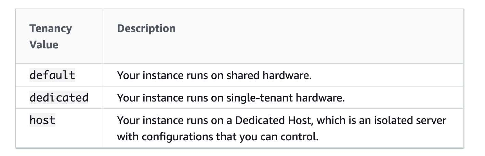

import TOCInline from '@theme/TOCInline';
import Tag from '@site/src/components/Tag';

- A launch template specifies instance configuration information. It includes the ID of the Amazon Machine Image (AMI), the instance type, a key pair,
  security groups, and other parameters used to launch EC2 instances.
  While creating a Launch Template, **the default value for the instance tenancy is shared and the instance tenancy is controlled by the tenancy attribute of the VPC**.
  If you set the Launch Template Tenancy to shared (default) and the VPC Tenancy is set to dedicated, then the instances have dedicated tenancy.
  If you set the Launch Template Tenancy to dedicated and the VPC Tenancy is set to default, then again the instances have dedicated tenancy.
- By default, Amazon EC2 instances run on a shared-tenancy basis.
	- Dedicated Instances are Amazon EC2 instances that run in a virtual private cloud (VPC) on hardware that's dedicated to a single customer. 
    Dedicated Instances that belong to different AWS accounts are physically isolated at the hardware level.
    However, Dedicated Instances may share hardware with other instances from the same AWS account that is not Dedicated Instances.
	- A Dedicated Host is also a physical server that's dedicated to your use. With a Dedicated Host, you have visibility and control over how instances are placed on the server.
	- 
- A **Spot Instance** is an unused **Amazon EC2 instance** that is available for less than the On-Demand price. Because Spot Instances enable you to request unused Amazon EC2 instances at steep discounts,
you can lower your Amazon EC2 costs significantly. The hourly price for a Spot Instance is called a Spot price.
The Spot price of each instance type in each Availability Zone is set by Amazon EC2 and adjusted gradually based on the long-term supply of and demand for Spot Instances.
- **Recover Impaired EC2 instance** : Amazon CloudWatch alarm to automatically recover the Amazon EC2 instance if it becomes impaired due to an underlying hardware failure or a problem that requires AWS involvement to repair.
  Terminated instances cannot be recovered. A recovered instance is identical to the original instance, including the instance ID, private IP addresses, Elastic IP addresses, and all instance metadata.
  If the impaired instance is in a placement group, the recovered instance runs in the placement group. If your instance has a public IPv4 address, **it retains the public IPv4 address after recovery**.
  During instance recovery, the instance is migrated during an instance reboot, and any data that is in-memory is lost.
- **FSx for Lustre with Deployment Type as Scratch File System** is designed for temporary storage and shorter-term data processing.
  Data isn't replicated and doesn't persist if a file server fails.
  Scratch file systems provide high burst throughput of up to six times the baseline throughput of 200 MBps per TiB storage capacity.
- **Amazon Redshift** is a fully managed, <Tag color="RED">petabyte-scale data warehouse service</Tag> in the cloud. With an Amazon Redshift database as a target, you can migrate data from all of the other supported source databases.
- **Amazon Route 53** <Tag color="BLUE">doesn't charge for alias queries</Tag> to AWS resources but Route 53 does charge for CNAME queries.
  Additionally, an alias record can only redirect queries to selected AWS resources such as Amazon S3 buckets, Amazon CloudFront distributions,
  and another record in the same Amazon Route 53 hosted zone; however a CNAME record can redirect DNS queries to any DNS record.

- You can create an alias record at the top node of a DNS namespace, also known as the zone apex, however, you cannot create a CNAME record for the top node of the DNS namespace.
  So, if you register the DNS name covid19survey.com, the zone apex is covid19survey.com. You can't create a CNAME record for covid19survey.com,
  but you can create an alias record for covid19survey.com that routes traffic to www.covid19survey.com.

- An **Internet Gateway** serves two purposes: to provide a target in your VPC route tables for internet-routable traffic and to perform <Tag color="BLUE"> network address translation (NAT) for instances </Tag> that have been assigned public IPv4 addresses.
- A **Spot Instance** request is either <Tag color="YELLOW">one-time</Tag> or <Tag color="PINK">persistent</Tag>. If the spot request is persistent, the request is opened again after your Spot Instance is interrupted.
  If the request is persistent and you stop your Spot Instance, the request only opens after you start your Spot Instance.
  - Spot Fleets can maintain target capacity by launching replacement instances after Spot Instances in the fleet are terminated
  - When you cancel an active spot request, it does not terminate the associated instance
  - When you cancel an active spot request, it terminates the associated instance as well
- **Amazon SQS** provides short polling and long polling to receive messages from a queue. By default, queues use short polling.
  With short polling, Amazon SQS sends the response right away, even if the query found no messages. With long polling, Amazon SQS sends a response after it collects at least one available message, up to the maximum number of messages specified in the request.
  Amazon SQS sends an empty response only if the polling wait time expires.
    <Tag color="BLUE">Long polling makes it inexpensive</Tag> to retrieve messages from your Amazon SQS queue as soon as the messages are available. Using long polling can reduce the cost of using SQS because you can reduce the number of empty receives.
- **AWS CloudFormation StackSet** extends the functionality of stacks by enabling you to create, update, or delete stacks across multiple accounts and regions with a single operation.
  A stack set lets you create stacks in AWS accounts across regions by using a single AWS CloudFormation template. Using an administrator account of an "AWS Organization",
  you define and manage an AWS CloudFormation template, and use the template as the basis for provisioning stacks into selected target accounts of an "AWS Organization" across specified regions.

- **Elastic Load Balancing** stops sending requests to instances that are de-registering or unhealthy while keeping the existing connections open, use <Tag color="BLUE">connection draining</Tag>. This enables the load balancer to complete in-flight requests made to instances that are de-registering or unhealthy.
  The maximum timeout value can be set between 1 and 3,600 seconds (the default is 300 seconds).
  When the maximum time limit is reached, the load balancer forcibly closes connections to the de-registering instance.
- <Tag color="BLUE">The active-active configuration</Tag> of **DynamoDB global tables**, there is no concept of failover because the application <ins>writes to the table in its region, and then the data is replicated to keep the other regions' table in sync.</ins>
  DynamoDB global tables is a much costlier solution than Aurora Global Database for the given requirement. 
- **VPC sharing (part of Resource Access Manager) **allows multiple AWS accounts to create their application resources such as Amazon EC2 instances, Amazon RDS databases, Amazon Redshift clusters, and AWS Lambda functions, into shared and centrally-managed Amazon Virtual Private Clouds (VPCs).
  Using VPC sharing, an account that owns the VPC (owner) shares <Tag color="GREEN">one or more subnets with other accounts</Tag> (participants) that belong to the same organization from AWS Organizations. The owner account cannot share the VPC itself.
- <Tag color="RED">Elastic Fabric Adapter (EFA)</Tag>
  - An Elastic Fabric Adapter (EFA) is a network device that you can attach to your Amazon EC2 instance to accelerate High Performance Computing (HPC) and machine learning applications.
    It enhances the performance of inter-instance communication that is critical for scaling HPC and machine learning applications.
    EFA devices provide all Elastic Network Adapter (ENA) devices functionalities plus a new OS bypass hardware interface that allows user-space applications to communicate directly with the hardware-provided reliable transport functionality.
 

