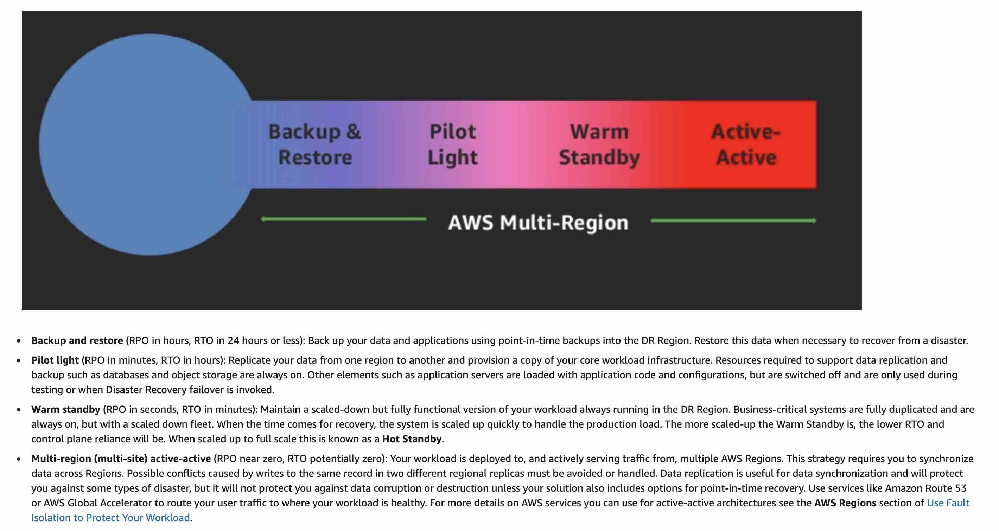

import TOCInline from '@theme/TOCInline';
import Tag from '@site/src/components/Tag';

## AWS Lambda

- <Tag color="#800080">AWS Lambda functions</Tag> always operate from an AWS-owned VPC.  
  By default, Lambda functions have **full access to the public internet**, including AWS APIs (e.g., <Tag color="GREEN">DynamoDB</Tag> `PutItem`, `Query`).  
  VPC access is only required when interacting with private resources in private subnets (e.g., RDS).  
   Source: [AWS Blog](https://aws.amazon.com/blogs/architecture/best-practices-for-developing-on-aws-lambda/)

- Since Lambda can scale rapidly, implement <Tag color="BLUE">CloudWatch Alarms</Tag> for metrics like `ConcurrentExecutions` or `Invocations`.  
  Also, use <Tag color="BLUE">AWS Budgets</Tag> to monitor costs.

---

## Amazon S3 and Glacier Compliance

- <Tag color="GREEN">Amazon S3 Object Lock</Tag> in Compliance mode + <Tag color="GREEN">S3 Glacier Vault Lock</Tag> provides ideal WORM protection for regulatory compliance.

- <Tag color="GREEN">S3 Object Lock</Tag> ensures **write-once-read-many** data integrity.  
- <Tag color="GREEN">S3 Glacier Vault Lock</Tag> enforces **immutable archive policies** that can't be modified once set.

---

## Disaster Recovery (DR) Strategies

<Tag color="#ffb347">Disaster Recovery (DR)</Tag> involves restoring infrastructure after disruption. AWS supports multiple DR models:

### Pilot Light

- Minimal core services always running in the cloud.  
- Allows fast ignition of full infrastructure during recovery.  
- Example: Core system components like databases always running on AWS.

### Backup and Restore

- Traditional backup to offsite (e.g., tapes) → slow recovery.  
- With AWS, use <Tag color="GREEN">Amazon S3</Tag> as backup destination for faster network-based restores.

### Warm Standby

- A <Tag color="#f08080">scaled-down functional environment</Tag> always running.  
- Faster than pilot light due to running app components.

### Multi-Site (Active-Active)

- Runs in both AWS and on-premise infrastructure.  
- Use <Tag color="BLUE">Recovery Point Objective (RPO)</Tag> and <Tag color="BLUE">Recovery Time Objective (RTO)</Tag> to guide data replication.  
- Costlier but most resilient.

  
Source: [AWS DR Guide](https://docs.aws.amazon.com/wellarchitected/latest/reliability-pillar/plan-for-disaster-recovery-dr.html)

---

## IAM Roles

### Trust Policy

- Trust policies define who (principals) can assume the role.  
- IAM roles need:
  - <Tag color="BLUE">Trust policy</Tag>
  - <Tag color="BLUE">Identity-based policy</Tag>  
- IAM only supports one resource-based policy type: role trust policy.

---

## Amazon API Gateway

<Tag color="#ffb347">API Gateway</Tag> enables:
- REST and WebSocket APIs
- Serverless and containerized workloads
- Monitoring, throttling, and caching

Acts as the "front door" for backend service access.

---

## Amazon EventBridge vs SNS

- <Tag color="RED">Amazon SNS</Tag> does **not** support third-party integration.  
- Use <Tag color="GREEN">Amazon EventBridge</Tag> to react to events from:
  - SaaS apps
  - AWS services

---

## AWS Auto Scaling Group (ASG)

- Even if ASG spans 3 AZs, setting `minCapacity = 2` launches 2 instances in separate AZs.  
- When load increases, a 3rd instance is added in the 3rd AZ.  
- ASG scales-in again to maintain 2-instance HA baseline.

---

## AWS DMS & DynamoDB

<Tag color="#ffb347">AWS DMS</Tag> supports data migration between:
- Relational DBs
- Data warehouses
- Streaming platforms
- AWS data stores

### DynamoDB

<Tag color="#ffb347">Amazon DynamoDB</Tag> read/write modes:
- <Tag color="GREEN">On-demand</Tag>
- <Tag color="#f08080">Provisioned</Tag> (default & free-tier eligible)

<Tag color="GREEN">On-demand</Tag> mode is ideal if:
- Workload is unpredictable
- Usage is unknown
- You want pay-per-request pricing

Additional features:
- <Tag color="BLUE">Deletion protection</Tag>: prevents accidental table removal
- <Tag color="BLUE">Point-in-time recovery (PITR)</Tag>: restore within last 35 days (but doesn’t prevent deletion)

---

## AWS RDS

- <Tag color="#ffb347">IAM authentication</Tag> is an alt login mechanism.
- For in-transit encryption, use <Tag color="GREEN">SSL</Tag> — it offers stronger security guarantees than IAM alone.

---

## VPC Gateway Endpoints

- A <Tag color="#ffb347">Gateway Endpoint</Tag> lets your VPC route traffic to:
  - <Tag color="GREEN">Amazon S3</Tag>
  - <Tag color="GREEN">DynamoDB</Tag>

Used to securely access these services without needing internet access or NAT.

---

## Load Balancers

- <Tag color="#ffb347">Network Load Balancer (NLB)</Tag>:
  - Provides a <Tag color="BLUE">static public IP</Tag>
  - Ideal for predictable addressing
  - Enables scalability via ASG behind the NLB
