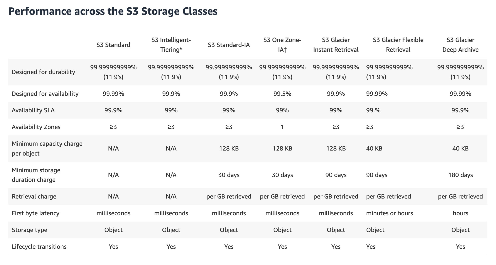
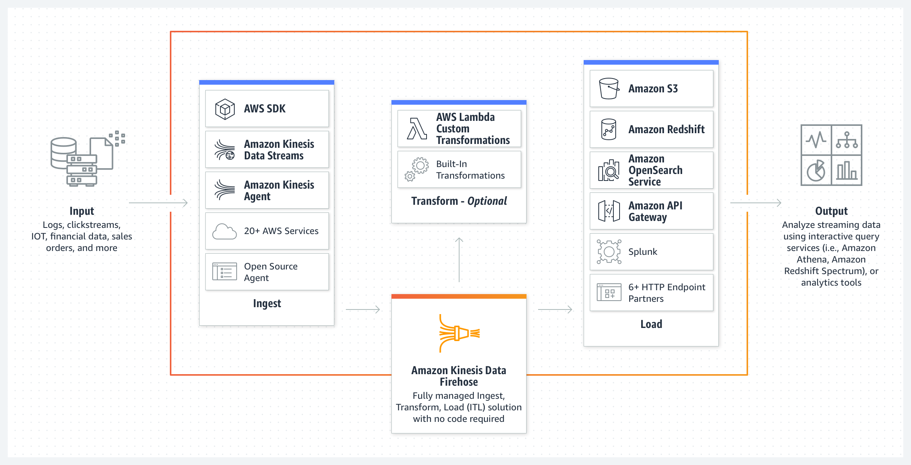
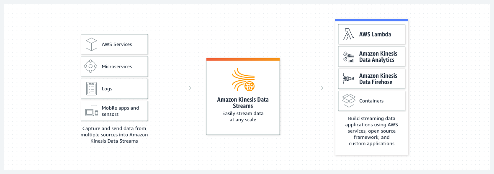

import TOCInline from '@theme/TOCInline';
import Tag from '@site/src/components/Tag';

## AWS WAF & CloudFront Integration

- AWS WAF is tightly integrated with Amazon CloudFront and the Application Load Balancer (ALB), services commonly used to deliver web content.
- When used with CloudFront, <Tag color="#1e90ff">WAF rules run at AWS Edge Locations globally</Tag>, protecting any HTTP web server including EC2 and on-premises servers.
- <Tag color="#1e90ff">You can enforce HTTPS</Tag> between CloudFront and your server and between CloudFront and viewers.

## Amazon S3 Storage Classes & Security

- The <Tag color="#1e90ff">S3 Intelligent-Tiering</Tag> class optimizes storage costs by automatically transitioning objects between frequent and infrequent access tiers.
- Amazon S3 Bucket Keys <Tag color="#ffa500">reduce SSE-KMS costs</Tag> by generating unique data keys locally per object, reducing AWS KMS API calls by up to 99%.
  - <Tag color="#ffa500">Using a VPC endpoint for S3 enhances security and network cost-efficiency</Tag>, but doesn’t affect KMS pricing.
- The <Tag color="#1e90ff">S3 Snapshot Recycle Bin</Tag> retains deleted EBS snapshots for a configurable period (e.g., 7 days) to allow recovery from accidental deletion.

## Amazon Kinesis

- <Tag color="#1e90ff">Kinesis Data Firehose</Tag> is an ETL service that captures and delivers streaming data to destinations like data lakes and analytics services.
  - It supports <Tag color="#ffa500">only one destination per stream</Tag> (no multi-consumer setup).
  - 

- <Tag color="#1e90ff">Kinesis Data Streams</Tag> require batching and parallel HTTP requests to efficiently send large numbers of records.
  - <Tag color="#ffa500">Simply looping PutRecord API calls is not efficient.</Tag>
  - 

## Amazon FSx vs EFS in Transfer Family

- <Tag color="#ffa500">Amazon FSx for Lustre is not natively supported by AWS Transfer Family for SFTP</Tag>.
- <Tag color="#1e90ff">Amazon EFS is supported</Tag> by Transfer Family and enables secure access, IAM-based policies, and POSIX permissions when deployed with Elastic IPs in a VPC.

## High Availability and Failover

- An <Tag color="#1e90ff">active-passive failover</Tag> configuration ensures standby resources are ready if primaries go down.
- <Tag color="#ffa500">Amazon RDS Multi-AZ</Tag> handles failovers automatically by switching the DNS CNAME to the standby, promoting it as the new primary.

## AWS Global Accelerator

- <Tag color="#1e90ff">Lets you associate static anycast IPs</Tag> to AWS resources like ALBs, NLBs, EC2, and Elastic IPs.
- Enables <Tag color="#1e90ff">seamless endpoint migration</Tag> across AZs or Regions without DNS changes.
- Allows traffic control via <Tag color="#ffa500">traffic dials</Tag> and <Tag color="#ffa500">endpoint weights</Tag> for blue/green deployments or performance testing.

## Amazon ElastiCache for Session Management

- Supports in-memory caching using <Tag color="#1e90ff">Memcached</Tag> or <Tag color="#1e90ff">Redis</Tag>, ideal for use cases like:
  - Real-time analytics
  - Caching
  - Messaging
  - Leaderboards
  - Geospatial use cases
  - ML and streaming applications
  - Session stores

## CloudFront CDN and S3

- CloudFront <Tag color="#1e90ff">caches content at edge locations</Tag> after the initial request to Amazon S3.
- This <Tag color="#ffa500">significantly improves performance</Tag> for repeated uploads/downloads like video files.
- [Blog Reference](https://aws.amazon.com/blogs/aws/amazon-cloudfront-content-uploads-post-put-other-methods/)

## 🔥 Super Important

- <Tag color="#ff0000"><strong>CloudFront only supports ACM certificates</strong></Tag> from the `us-east-1` (N. Virginia) Region, even if your application is hosted elsewhere.
  - <Tag color="#ff0000"><strong>Custom domain HTTPS for CloudFront must use a certificate from this region</strong></Tag>

## AWS Application Load Balancer (ALB)
- The AWSEC2-PatchLoadBalancerInstance Systems Manager Automation document is specifically designed for patching EC2 instances that are part of a load balancer. It automatically removes the instance from the ALB target group, waits for in-flight requests to complete, applies patches, performs reboots if needed, and then safely re-registers the instance. This workflow prevents application downtime or request failures during patching and ensures compliance with security policies.
- Systems Manager Maintenance Windows can be configured to run Automation documents or Lambda functions at precise times. You can schedule a task to remove instances from the load balancer using pre-defined documents (such as AWSEC2-PatchLoadBalancerInstance) and then re-register them once patching is complete. This offers fine-grained scheduling and orchestration for controlled patching without disrupting traffic.

## EC2 Instance Types
- <Tag color="#ff0000">Amazon EBS volumes</Tag> are particularly well-suited for use as the primary storage for file systems, databases, or for any applications that require fine granular updates and access to raw, unformatted, block-level storage.
- For <Tag color="#ff0000">high I/O performance</Tag>, <Tag color="#00ff00">instance store volumes</Tag> are a better option.
