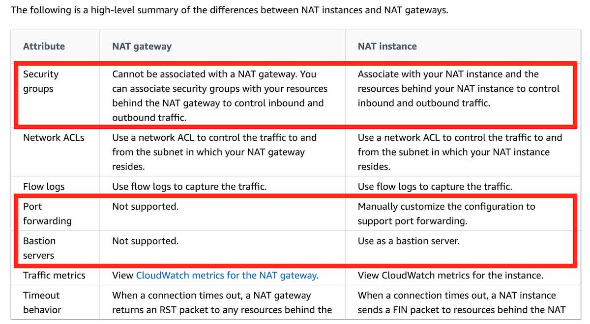
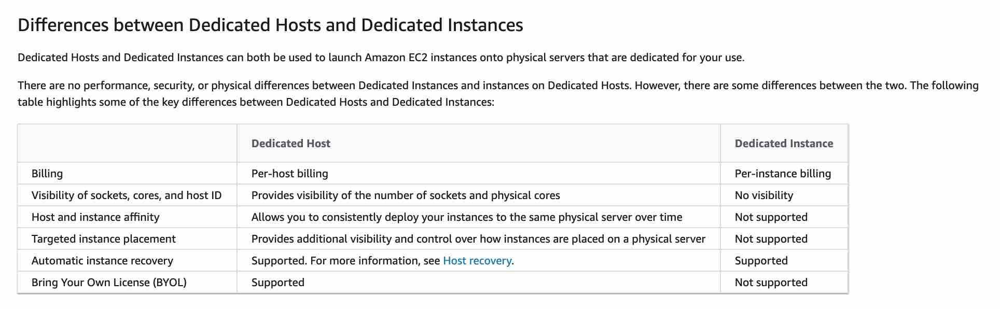

import TOCInline from '@theme/TOCInline';
import Tag from '@site/src/components/Tag';

## S3

- S3 Storage Lens provides a centralized, organization-wide view of storage usage and activity metrics, including versioning status. When advanced metrics are enabled, the dashboard offers per-bucket insights to help identify buckets where versioning is **not enabled**. <Tag color="#eab308">Scans all Regions and accounts</Tag>, making it highly scalable and efficient.
- Amazon S3 <Tag color="#22c55e">server access logging</Tag> provides detailed records of requests made to a bucket. AWS recommends using <Tag color="#3b82f6">CloudTrail</Tag> instead for more detailed bucket and object-level logs, better storage, analysis, and automation.
- Amazon S3 provides <Tag color="#22c55e">strong read-after-write consistency</Tag> automatically—no extra cost, no impact on performance, and retains regional isolation.
- <Tag color="#f97316">Minimum 30 days</Tag> is required before you can transition objects from S3 Standard to One Zone-IA / Standard-IA / Intelligent Tiering / Glacier.

---
## AWS SQS

- <Tag color="#22c55e">Temporary queues</Tag> save time and cost when using common messaging patterns like request-response.
  - Serve as lightweight channels for specific threads or processes.
  - Created and deleted with <Tag color="#a855f7">no extra cost</Tag>.
  - Fully compatible with static SQS queues—<Tag color="#facc15">no code changes needed</Tag>.
- <Tag color="#e879f9">Delay queues</Tag> allow you to postpone message delivery—for example, when consumers need more time to process.

---
## VPC

- <Tag color="#3b82f6">Public VIF</Tag> gives your on-prem router access to **public AWS services** (S3, DynamoDB) via Direct Connect—not public internet.
- <Tag color="#3b82f6">Private VIF</Tag> connects your on-prem network to VPC resources like EC2/RDS via private IP space.
- <Tag color="#22d3ee">NAT Instance vs NAT Gateway:</Tag>  
  

---
## Elastic Load Balancer

- When using **instance IDs** as targets, ELB routes traffic to the instance’s <Tag color="#f472b6">primary private IP</Tag> on the <Tag color="#e879f9">primary network interface</Tag>.
- When using **IP addresses**, you can use any private IP from multiple ENIs. This allows multiple apps on the same instance to share ports. Each ENI can have its own <Tag color="#f97316">security group</Tag>. The destination IP is rewritten by ELB before forwarding.

---
## Placement Groups

- **Spread Placement Group**:
  - Instances are placed on **distinct racks**—each with its own network and power.
  - Recommended for <Tag color="#a3e635">small number of critical instances</Tag> that must be isolated from each other.
  - Reduces risk of simultaneous hardware failure.
  - <Tag color="#facc15">Max 7 running instances per AZ</Tag>. To launch 15 instances in one group, use <Tag color="#3b82f6">3 AZs</Tag>.
---
## EC2

- **Launch Template**:
  - Replaces Launch Config. Allows **multiple versions**, includes AMI ID, instance type, key pair, security groups, etc.
  - Enables **mixed instance types** and use of both <Tag color="#3b82f6">On-Demand</Tag> and <Tag color="#3b82f6">Spot Instances</Tag>—for scale, performance, and cost optimization.
- **Launch Configuration**:
  - Older instance config method. No versioning support.
- **Golden AMI**:
  - A <Tag color="#facc15">pre-hardened, patched, standardized AMI</Tag> with all required security, monitoring, and logging agents installed.
- <Tag color="#22c55e">Root EBS volume</Tag> is deleted by default when the instance terminates. You can change this behavior.
  - <Tag color="#e879f9">Non-root EBS volumes persist</Tag> even after instance termination.

<Tag color="#ef4444">Provisioned IOPS SSD (io1) supports up to 64,000 IOPS and meets 25,000 IOPS requirement</Tag> — ✅ Best choice for I/O-intensive workloads.

### ✅ <strong>AWS Spot Pricing Rules</strong>

1. <strong>You are charged the spot price that was in effect at the beginning of each instance-hour</strong>  
   <em>(not the price at the time of termination)</em>.

2. <strong>You are billed in one-second increments</strong>, with a <strong>1-minute minimum</strong>.

3. <strong>If AWS terminates your Spot Instance</strong>  
   <em>(due to price changes or capacity needs)</em>,  
   <strong>you are <u>not charged</u> for the partial hour</strong> in which the instance is terminated.

4. <strong>If <u>you</u> terminate the instance</strong>, you <strong>are charged</strong> for the partial hour.

### Difference Between Dedicated Host and Instance

---

