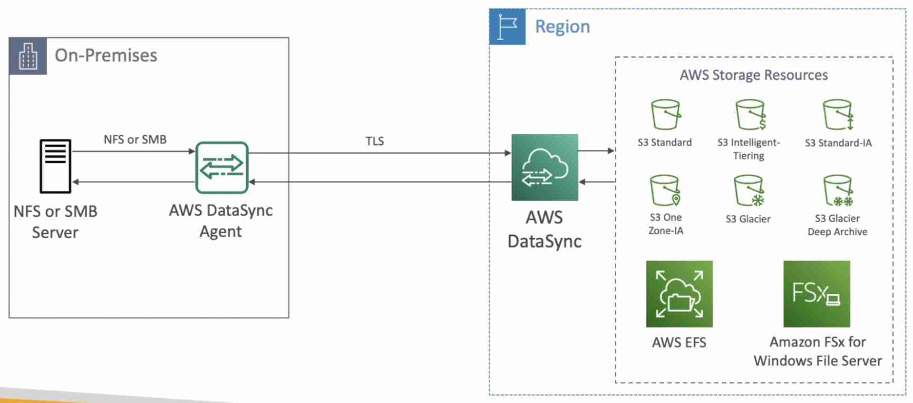
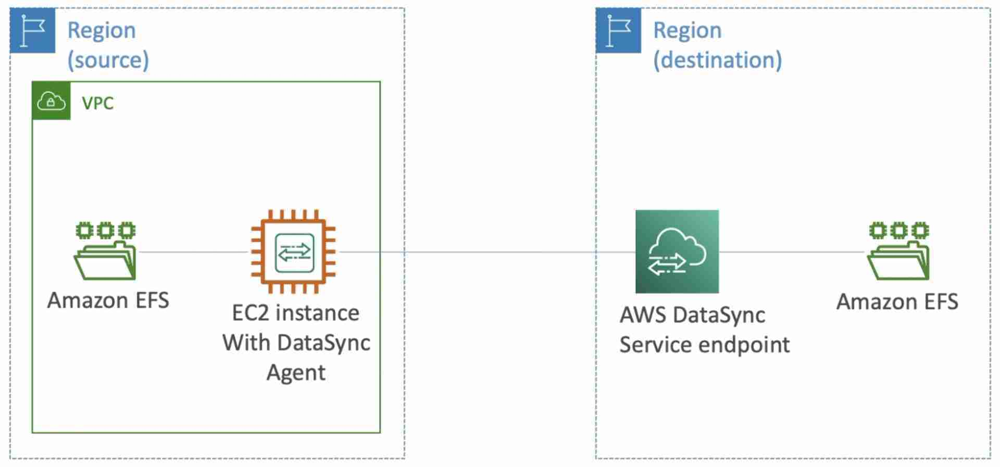

import TOCInline from '@theme/TOCInline';
import Tag from '@site/src/components/Tag';

Move large amounts of data from your on-premises NAS or file system via NFS or SMB protocol to AWS over the public internet using TLS
Can synchronize to:
- S3 (all storage classes)
- EFS
- FSx for Windows

**Scheduled Replication** (not continuous)
Need to install **AWS DataSync Agent** on premises

Can also be used to transfer between two EFS in different regions

Suitable in automating and accelerating online data transfers to a variety of AWS storage services (over [Storage Gateway](StorageGateway.mdx) which only works with S3)
:::note
Perfect to move large amounts of historical data from on-premises to S3 Glacier Deep Archive (directly).
:::