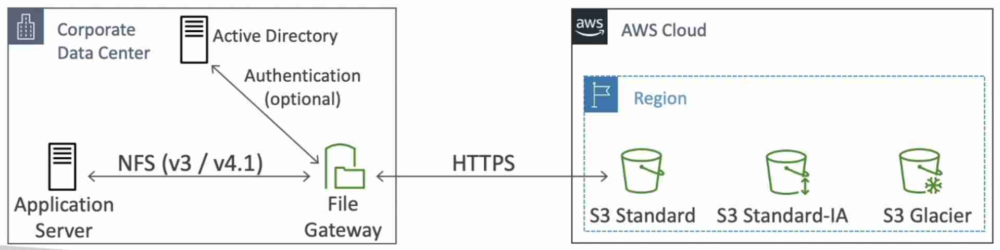
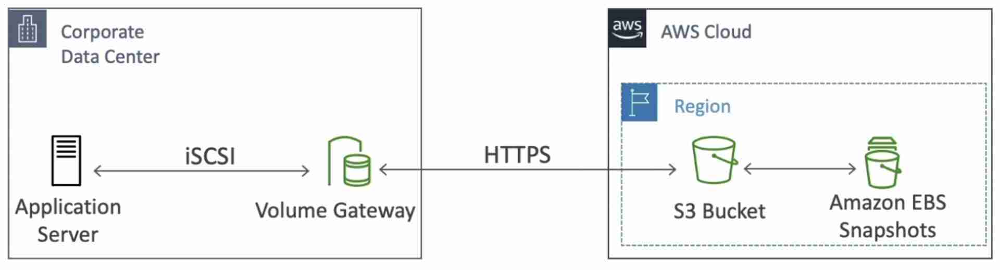
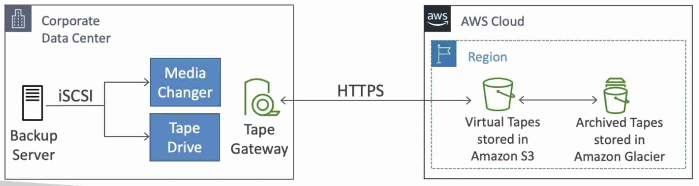
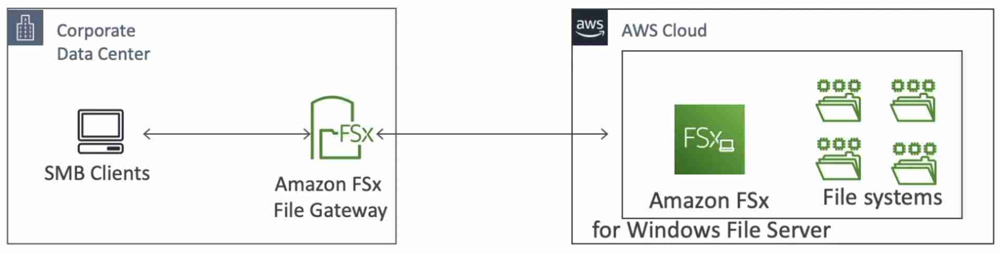

import TOCInline from '@theme/TOCInline';
import Tag from '@site/src/components/Tag';

{/* <TOCInline toc={toc} minHeadingLevel={2} maxHeadingLevel={6} /> */}
- Bridge between on-premises data and [S3](../Storage/SImple-Storage-Service-S3.mdx) for **Hybrid Cloud**
- Not suitable for one-time sync of large amounts of data (use [DataSync](./DataSync.mdx) instead)
- Optimizes data transfer by sending only changed data

## Types of Storage Gateway

### S3 File Gateway
- Used to expand on-premise NFS by leveraging S3
- Configured S3 buckets are accessible on premises using the NFS and SMB protocol
- Data is cached at the file gateway for low latency access
- Can be mounted on many servers on-premises
- Integrated with Active Directory (AD) for user authentication

### Volume Gateway
- Used for on-premise storage volumes
- Uses **iSCSI protocol**
- Two kinds of volumes:
  - **Cached volumes**: storage extension using S3 with caching at the volume gateway
  - **Stored volumes**: entire dataset is on premise, scheduled backups to S3 as **EBS snapshots**

### Tape Gateway
- Used to backup on-premises data using tape-based process to S3 as Virtual Tapes
- Uses **iSCSI protocol**

### FSx File Gateway
- Used to expand on-premise Windows-based storage by leveraging FSx for Windows
- Windows native compatibility (SMB, NTFS, Active Directory)
- **Data is cached at the file gateway** for low latency access

## Storage Gateway - Hardware Appliance
- Storage Gateway requires on-premises virtualization. If you don’t have virtualization available, you can use a Storage Gateway - Hardware Appliance. It is a mini server that you need to install on-premises.
- **Does not work with FSx File Gatway**
