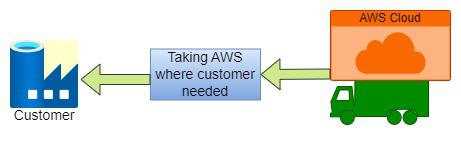

import TOCInline from '@theme/TOCInline';
import Tag from '@site/src/components/Tag';

## Key Components of AWS Edge Services

AWS Edge Services encompass a wide range of functionalities tailored to meet the diverse needs of modern applications and services. Some key components include:

- **Amazon CloudFront**: As a global content delivery network (CDN) service, CloudFront accelerates the delivery of static and dynamic web content to users across the globe.
By caching content at edge locations and leveraging intelligent routing algorithms, CloudFront ensures low-latency access to web assets, thereby enhancing performance and scalability.
- **Amazon Route 53**: Route 53 is a highly available and scalable domain name system (DNS) web service that routes users to optimal endpoints based on factors such as geographic location, latency, and health checks.
By directing traffic to the nearest edge location, Route 53 minimizes DNS resolution time and improves the reliability of web applications.
- **AWS Lambda@Edge**: Lambda@Edge extends the capabilities of AWS Lambda by enabling the execution of serverless code at edge locations.
This allows developers to implement custom logic for processing web requests, modifying responses, and executing business logic closer to end-users. With Lambda@Edge, applications can achieve real-time personalization,
  content customization, and security enforcement at the edge.
- **Amazon S3 Transfer Acceleration**: S3 Transfer Acceleration leverages CloudFront's global network to accelerate file uploads to Amazon Simple Storage Service (S3). By optimizing data transfer paths and reducing network latency,
Transfer Acceleration enables faster uploads and downloads, particularly for geographically distributed users.

## Benefits of AWS Edge Services
The adoption of AWS Edge Services offers several compelling benefits for businesses and developers:
- **Improved Performance**: By minimizing latency and optimizing content delivery, AWS Edge Services enhance the responsiveness and user experience of web applications and services.
- **Global Scalability**: With a distributed network architecture spanning multiple continents, AWS Edge Services scale effortlessly to accommodate fluctuations in traffic volume and ensure consistent performance worldwide.
- **Enhanced Security**: Edge locations serve as an additional layer of defense against cyber threats, enabling the enforcement of security policies closer to end-users and mitigating the impact of distributed denial-of-service (DDoS) attacks.
- **Cost Efficiency**: By reducing data transfer costs, optimizing bandwidth usage, and offloading compute tasks to edge locations, AWS Edge Services help businesses optimize their cloud infrastructure spending and maximize cost efficiency.

## Conclusion
As the digital landscape continues to evolve, AWS Edge Services emerge as a cornerstone of modern cloud computing architectures, enabling businesses to deliver faster, more reliable, and more scalable experiences to users worldwide.
By leveraging a distributed network of edge locations, AWS Edge Services empower developers to build responsive applications, accelerate content delivery, and innovate with unprecedented agility. As organizations embrace the era of edge computing,
AWS Edge Services stand poised to drive the next wave of digital transformation and shape the future of cloud computing.
