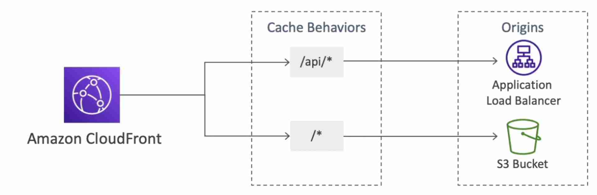
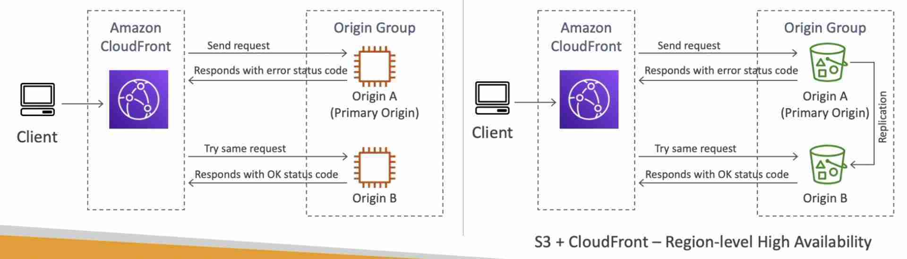

import TOCInline from '@theme/TOCInline';
import Tag from '@site/src/components/Tag';

{/* <TOCInline toc={toc} minHeadingLevel={2} maxHeadingLevel={6} /> */}

## Introduction

- Global service
- Global Content Delivery Network (CDN)
- **Edge Locations are present outside the VPC** so the origin's SG must be configured to allow inbound requests from the list of public IPs of all the edge locations.
- Supports HTTP/RTMP protocol (**does not support UDP protocol**)
- **Caches content at edge locations**, reducing load at the origin
- **Geo Restriction feature**
- Improves performance for both cacheable content (such as images and videos) and dynamic content (such as API acceleration and dynamic site delivery)
- To block a specific IP at the CloudFront level, deploy a WAF on CloudFront
- Supports **Server Name Indication** (SNI) to allow SSL traffic to multiple domains

## Origin
- [S3 Bucket](../Storage/SImple-Storage-Service-S3.mdx)
  - For distributing static files
  - **Origin Access Identity (OAl) or Origin Access Control (OAC) **allows the S3 bucket to only be accessed by CloudFront
  - Can be used as ingress to upload files to S3
- **Custom Origin (for HTTP)** - need to be publicly accessible on HTTP by public IPs of edge locations
  - EC2 Instance
  - ELB
  - S3 Website (may contain client-side script)
  - On-premise backend

:::tip
To restrict access to ELB directly when it is being used as the origin in a CloudFront distribution, create a VPC Security Group for the ELB and use AWS Lambda to automatically update the CloudFront internal service IP addresses when they change.
:::

## Signed URL / Cookies
- Used to **make a CloudFront distribution private** (distribute to a subset of users)
- Signed URL ⇒ access to individual files
- Signed Cookies ⇒ access to multiple files
- Whenever we create a signed URL / cookie, we attach a policy specifying:
- URL / Cookie Expiration (TTL)
- **IP ranges** allowed to access the data
- Trusted signers (which AWS accounts can create signed URLs)

## Pricing
- Price Class All: all regions (best performance)
- Price Class 200: most regions (excludes the most expensive regions)
- Price Class 100: only the least expensive regions

## Multiple Origin
- Route to different origins based on the path in the request

## Origin Groups
- Consists of a primary and a secondary origin (can be in different regions)
- Automatic failover to secondary

- Provides region-level [High Availability](../Concepts.mdx#high-availability)
- Use when getting 504 (gateway timeout) Error

## Field-level Encryption
- Sensitive information sent by the user is encrypted at the edge close to user which can only be decrypted by the web server (intermediate services can't see the encrypted fields)
- **Asymmetric Encryption** (public & private key)
- Max 10 encrypted field
