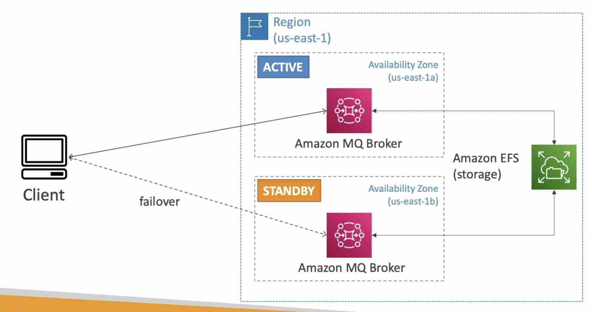

import TOCInline from '@theme/TOCInline';
import Tag from '@site/src/components/Tag';

- If you have some traditional applications running from on-premise, they may use open protocols such as **MQTT, AMQP, STOMP, Openwire, WSS**, etc. When migrating to the cloud, instead of re-engineering the application to use SQS and SNS (AWS proprietary), we can use Amazon MQ (managed Apache ActiveMQ) for communication.
- Doesn't “scale” as much as SQS or SNS because it is provisioned
- Runs on a dedicated machine (can run in HA with failover)
- **Has both queue feature (SQS) and topic features (SNS)**

## High Availability
---------------------------------------------------------

- [High Availability](../Concepts.mdx#high-availability) in Amazon MQ works by leveraging MQ broker in multi AZ (active and standby).
- EFS (NFS that can be mounted to multi AZ) is used to keep the files safe in case the main AZ is down. 

* * *