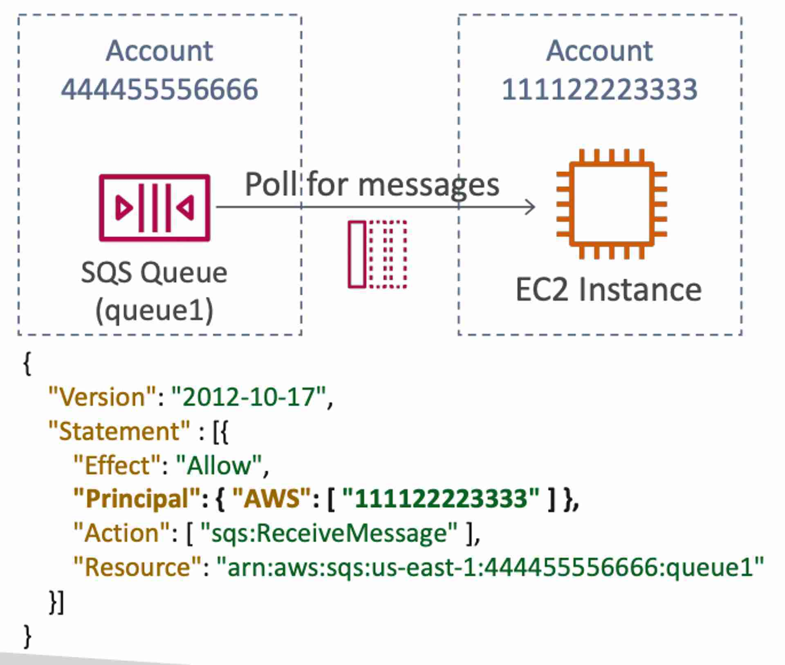
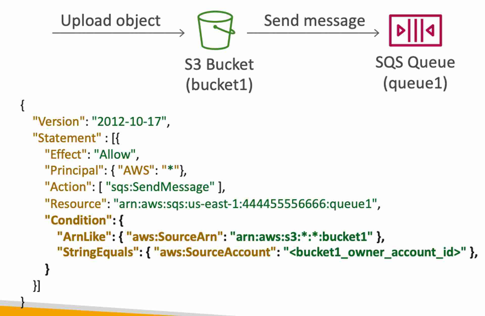
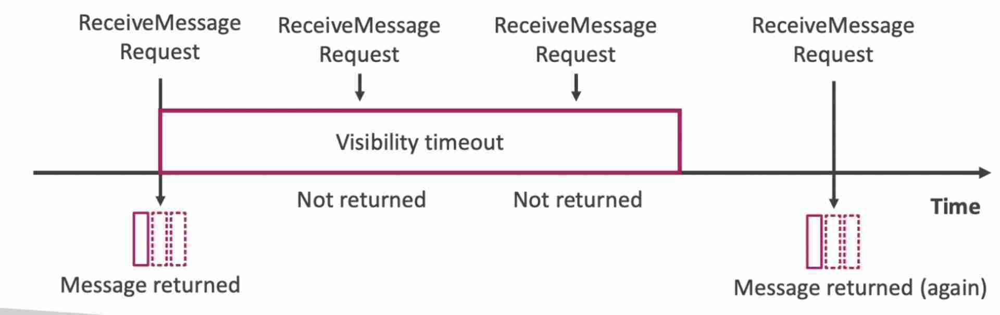
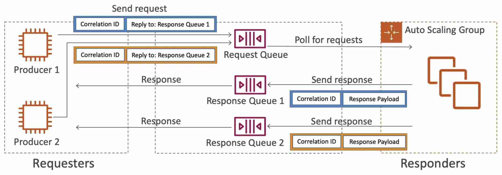
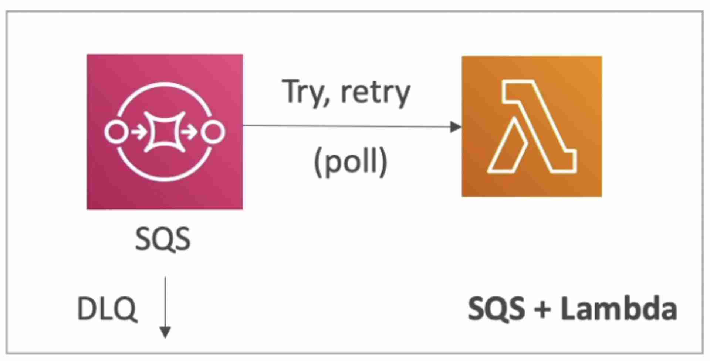

import TOCInline from '@theme/TOCInline';
import Tag from '@site/src/components/Tag';

- Used to asynchronously decouple applications
- Supports multiple producers & consumers
- The consumer polls the queue for messages. Once a consumer processes a message, it deletes it from the queue using **DeleteMessage*-API.
- Unlimited number of messages in queue
- Max 10 messages received per batch (configured using MaxNumberOfMessages parameter in the ReceiveMessage API)
- **Max message size: 256KB**
- **Default message retention: 4 days (max: 14 days)**
- **Consumers could be EC2 instances or Lambda functions**

:::note
SQS cannot ingest data, it must be sent to the queue by the producer (use Kinesis ⮕ Kinesis Data Stream KDS instead)
:::

## Queue Types
### Standard Queue
- Unlimited throughput (publish any number of message per second into the queue)
- Low latency (`< 10` ms on publish and receive)
- Can have duplicate messages (at least once delivery)
- Can have out of order messages (best effort ordering)

### FIFO Queue
-  Limited throughput
    -  300 msg/s without batching (batch size = 1)
    -  3000 msg/s with batching (batch size = 10)
-  **The queue name must end with** `.fifo` to be considered a FIFO queue
-  **Message De-duplication**
    -  De-duplication interval: 5 min (duplicate messages will be discarded only if they are sent less than 5 mins apart)
    -  De-duplication methods:
        -  **Content-based de-duplication**: computes the hash of the message body and compares
        -  **Using a message de-duplication ID**: messages with the same de-duplication ID are considered duplicates
-  **Message Grouping**
    -  Group messages based on `MessageGroupID` to send them to different consumers
    -  Same value for `MessageGroupID`
        -  All the messages are in order
        -  Single consumer
    -  Different values for `MessageGroupID`
        -  Messages will be ordered for each group ID
        -  Ordering across groups is not guaranteed
        -  Each group ID can have a different consumer (parallel processing)
        -  Max number of consumers = number of unique group IDs

### Consumer Auto Scaling
We can attach an [ASG](../Computing/EC2/Auto-Scaling-Groups.mdx) to the consumer instances which will scale based on the CW metric = Queue length / Number of EC2 instances. CW alarms can be triggered to step scale the consumer application.

### Encryption
-------------------------------------------

- In-flight encryption using HTTPS API
- At-rest server-side encryption:
    - SSE-SQS: keys managed by SQS
    - SSE-KMS: keys managed by KMS
- Client-side encryption

### Access Management
- **IAM Policies** to regulate access to the SQS API
- **SQS Access Policies** (resource based policy)
    - Used for cross-account access to SQS queues
        - The example policy allows any resource in the account 111122223333 to poll the SQS queue for messages. 
    - Used for allowing other AWS services to send messages to an SQS queue
        - The example policy allows any AWS account to send messages to the queue as long as it is coming from the desired S3 bucket and the source account is the one owning the bucket. 

### Configurations

#### Message Visibility Timeout

- Once a message is polled by a consumer, it becomes invisible to other consumers for the duration of message visibility timeout. After the message visibility timeout is over, the message becomes visible in the queue if it is not deleted by the consumer.
- If a consumer dies while processing the message, it will be visible in the queue after the visibility timeout.
- If a message is not processed within the visibility timeout, it will be processed again (by another consumer). However, a consumer could call the `ChangeMessageVisibility` API to change the visibility timeout for that specific message. This will give the consumer more time to process the message.
- **Default: 30s**
- Can be configured for the entire queue
    - High: if the consumer crashes, re-processing will take long
    - Low: may get duplicate processing of messages
- Image
    - 

#### Dead Letter Queue (DLQ)

- An SQS queue used to store failing to be processed messages in another queue
- After the `MaximumReceives` threshold is exceeded, the message goes into the DLQ
- **Redrive to Source** - once the bug in the consumer has been resolved, messages in the DLQ can be sent back to the queue (original queue or a custom queue) for processing
- Prevents resource wastage
- Recommended to set a high retention period for DLQ (14 days)

#### Queue Delay

- Consumers see the message after some delay
- Default: 0 (Max: 15 min)
- Can be set at the queue level
- Can override the default queue delay for a specific message using the `DelaySeconds` parameter in the `SendMessage` API

#### Long Polling

- Poll the queue for longer
- Decreases the number of API calls made to SQS (**cheaper**)
- Reduces latency (incoming messages during the polling will be read instantaneously)
- **Polling time: 1 sec to 20 sec**
- Long Polling is preferred over Short Polling
- Can be enabled at the queue level or at the consumer level by using `WaitTimeSeconds` parameter in `ReceiveMessage` API.

## Request-Response System
---------------------------------------------------------------------

- The idea is to build a request-response system where both the requesters and responders can scale independently. The requester sends the request into a request queue with attributes “correlation ID” and “reply to”. This request will be picked by one of many responders in an ASG. The request will be processed and it will be sent to the right response queue along with the same “correlation ID”. The “correlation ID” will help the requester identify which response corresponds to their request.
- To implement this pattern: use the **SQS Temporary Queue Client** which leverages virtual queues instead of creating / deleting SQS queues (cost-effective).
- 

## SQS + Lambda + DLQ
-------------------------------------------------------

- Failed messages (after the set number of retries) are sent to the DLQ by the SQS queue
    - 

## Handling Priority
---------------------------------------------------------
:::note
Use two SQS queues, one for low priority (ex. free) and the other for high priority (ex. paid). Configure your consuming application to only poll the low priority queue if the high priority queue is empty.
:::
* * *
