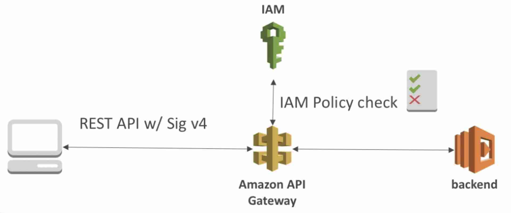
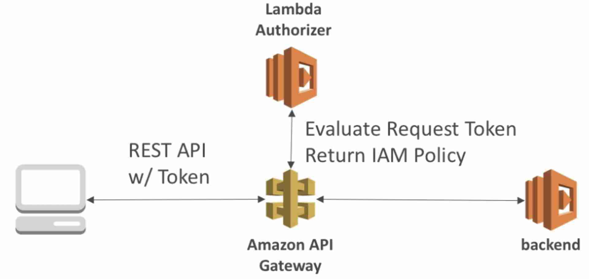
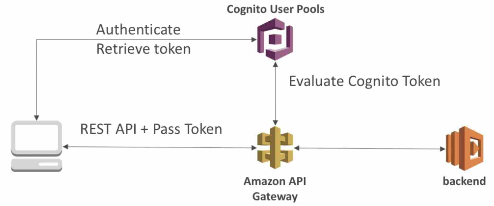
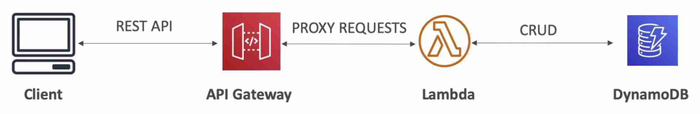

import TOCInline from '@theme/TOCInline';
import Tag from '@site/src/components/Tag';

{/* <TOCInline toc={toc} minHeadingLevel={2} maxHeadingLevel={2} /> */}
=============================================

- Serverless REST APIs
- Invoke Lambda functions using REST APIs (API gateway will proxy the request to lambda)
- Supports **WebSocket** (stateful)
- Rate Limiting (throttle requests) - returns **429 Too Many Requests**
- Cache API responses
- Transform and validate requests and responses
- **Can be integrated with any HTTP endpoint in the backend or any AWS API**
:::tip
> - We can use an API Gateway REST API to directly access a DynamoDB table by creating a proxy for the DynamoDB query API.
> - API cache is not enabled for a method, it is enabled for a stage
:::
## Endpoint Types
---------------------------------------------------

- **Edge-Optimized** (default)
    - For global clients
    - Requests are routed through the [CloudFront](../Distribution/CloudFront.mdx) edge locations (improves latency)
    - The API Gateway lives in only one region but it is accessible efficiently through edge locations
- **Regional**
    - For clients within the same region
    - Could manually combine with your own CloudFront distribution for global deployment (this way you will have more control over the caching strategies and the distribution)
- **Private**
    - Can only be accessed within your VPC using an **Interface VPC endpoint** (ENI)
    - Use resource policy to define access

## Access Management
---------------------------------------------------------

### IAM Policy

- Create an IAM policy and attach to User or Role to allow it to call an API
- Good to provide **access within your own AWS account**
- Leverages **Sig v4** where lAM credential are in the request headers
- Diagram
    - 

### Lambda Authorizer

- Uses a Lambda function to validate the token being passed in the header and return an lAM policy to determine if the user should be allowed to access the resource.
- Option to **cache result of authentication**
- For **OAuth / SAML / 3rd party type of authentication**
- Good to provide access outside your AWS account if you have an **existing IDP**
- Diagram
    - 

### Cognito User Pools (CUP)

- **Seamless integration with CUP** (no custom lambda implementation required)
- **Only supports authentication** (authorization must be implemented in the backend)
- The client (user) first authenticates with Cognito and gets the access token which it passes in the header to API gateway. API gateway validates the token using Cognito and then hits the backend if the token is valid.
- Diagram
    - 

## Serverless CRUD Application
-----------------------------------------------------------------------------

* * *