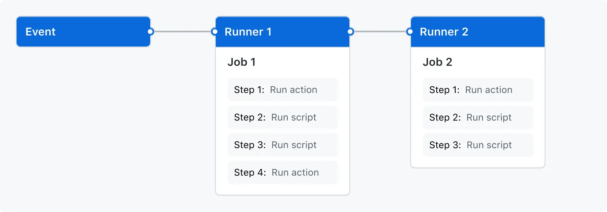

import TOCInline from '@theme/TOCInline';

<TOCInline toc={toc} minHeadingLevel={2} maxHeadingLevel={6} />

## Overview

## The Components

## Workflows

A **Workflow** is a configurable automated process that will run one or more jobs.
Workflows are defined by  a YAML file checked in to your repository

Workflows in your repo are defined in the following directory: `./github/workflows`

Workflow triggers are events that cause a workflow to run:
- Events that occur in your repo
- Events that occur outside of Github trigger a repository_dispatch event on Github
- Schedule Times
-  Manual

### Workflow  Components
 
- Actions
- Workflows
- Jobs
- Steps
- Runs
- Runners
- Marketplace

## Schedule Events

Schedule can use a cron expression to trigger a workflow at a specific time or day
